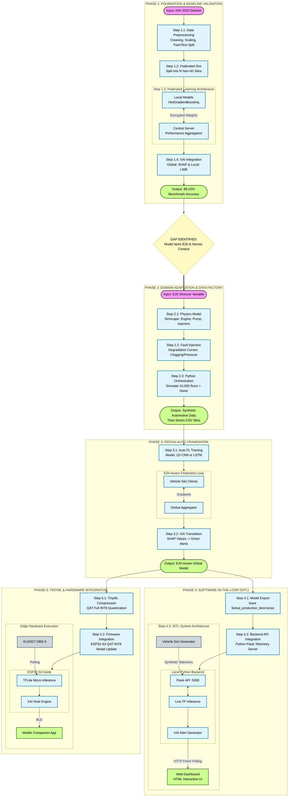

# FEDXAI-AUTO Project Blueprint & Architecture

Resulting Blueprint designed for [Mermaid Live Editor](https://mermaid.live).

```mermaid
graph TD
    %% Global Styles
    classDef input fill:#f9f,stroke:#333,stroke-width:2px,color:#000;
    classDef process fill:#e1f5fe,stroke:#0277bd,stroke-width:2px,color:#000;
    classDef output fill:#ccff90,stroke:#33691e,stroke-width:2px,color:#000;
    classDef decision fill:#fff9c4,stroke:#fbc02d,stroke-width:2px,stroke-dasharray: 5 5,color:#000;
    classDef hardware fill:#cfd8dc,stroke:#455a64,stroke-width:2px,color:#000;
    classDef edge_cloud fill:#e8eaf6,stroke:#1a237e,stroke-width:2px,stroke-dasharray: 2 2,color:#000;

    %% --- PHASE 1: FOUNDATION ---
    subgraph Phase1 [PHASE 1: FOUNDATION & BASELINE VALIDATION]
        direction TB
        P1_Input([Input: AI4I 2020 Dataset]):::input --> P1_S1[Step 1.1: Data Preprocessing<br/>Cleaning, Scaling, Train/Test Split]:::process
        P1_S1 --> P1_S2[Step 1.2: Federated Sim<br/>Split into N Non-IID Silos]:::process
        
        subgraph FL_Architecture [Step 1.3: Federated Learning Architecture]
            direction TB
            Local_M[Local Models<br/>HistGradientBoosting]:::process <-->|Encrypted Weights| Agg_S[Central Server<br/>Performance Aggregation]:::process
        end
        P1_S2 --> Local_M
        
        Agg_S --> P1_S4[Step 1.4: XAI Integration<br/>Global: SHAP & Local: LIME]:::process
        P1_S4 --> P1_Out([Output: 98.15% Benchmark Accuracy]):::output
    end

    P1_Out --> Gap{GAP IDENTIFIED:<br/>Model lacks E20 & Sensor Context}:::decision
    Gap ==> P2_E20

    %% --- PHASE 2: DATA FACTORY ---
    subgraph Phase2 [PHASE 2: DOMAIN ADAPTATION & DATA FACTORY]
        direction TB
        P2_Phys[Step 2.1: Physics Model<br/>Simscape: Engine, Pump, Injectors]:::process
        P2_E20([Input: E20 Stressor Variable]):::input --> P2_Phys
        
        P2_Phys --> P2_Fault[Step 2.2: Fault Injection<br/>Degradation Curves: Clogging/Pressure]:::process
        P2_Fault --> P2_Orch[Step 2.3: Python Orchestration<br/>Simulate 10,000 Runs + Noise]:::process
        P2_Orch --> P2_Out([Output: Synthetic Automotive Data<br/>Time-Series CSV Silos]):::output
    end
    %% --- PHASE 3: FRAMEWORK IMPL ---
    subgraph Phase3 [PHASE 3: FEDXAI-AUTO FRAMEWORK]
        direction TB
        P2_Out --> P3_Train[Step 3.1: Auto FL Training<br/>Model: 1D-CNN or LSTM]:::process
        
        subgraph New_FL_Arch [E20-Aware Federated Loop]
             direction TB
             Auto_Client[Vehicle Silo Clients]:::process <-->|Gradients| Auto_Server[Global Aggregator]:::process
        end
        P3_Train --> New_FL_Arch
        
        Auto_Server --> P3_XAI[Step 3.2: XAI Translation<br/>SHAP Values -> Driver Alerts]:::process
        P3_XAI --> P3_Out([Output: E20-Aware Global Model]):::output
    end
    %% --- PHASE 4: DEPLOYMENT ---
    subgraph Phase4 ["PHASE 4: SOFTWARE-IN-THE-LOOP (SITL)"]
        direction TB
        P3_Out --> P4_Comp["Step 4.1: Model Export<br/>Save fedxai_production_best.keras"]:::process
        P4_Comp --> P4_Int["Step 4.2: Backend API Integration<br/>Python Flask Telemetry Server"]:::process
        
        subgraph System_Arch [Step 4.3: SITL System Architecture]
            direction LR
            Sim[Vehicle Sim Generator]:::hardware -- Synthetic Telemetry --> API
            
            subgraph Backend_HW [Local Python Backend]
                API[Flask API :5000]:::process
                Edge_Inf[Live TF Inference]:::process
                Edge_XAI[XAI Alert Generator]:::process
                API <--> Edge_Inf
                Edge_Inf --> Edge_XAI
            end
            
            Edge_XAI -- HTTP Fetch Polling --> App[Web Dashboard<br/>HTML Interactive UI]:::output
        end
        P4_Int --> Backend_HW
    end

    %% --- PHASE 5: TINYML & HARDWARE INTEGRATION ---
    subgraph Phase5 [PHASE 5: TINYML & HARDWARE INTEGRATION]
        direction TB
        P3_Out --> P5_TinyML["Step 5.1: TinyML Compression<br/>QAT Full INT8 Quantization"]:::process
        P5_TinyML --> P5_FW["Step 5.2: Firmware Integration<br/>ESP32-S3 QAT INT8 Model Update"]:::process
        
        subgraph Edge_HW [Edge Hardware Execution]
            direction LR
            OBD2[ELM327 OBD-II]:::hardware -- Polling --> ESP32
            
            subgraph Microcontroller [ESP32-S3 Node]
                ESP32[TFLite Micro Inference]:::process
                Local_Rule[XAI Rule Engine]:::process
                ESP32 --> Local_Rule
            end
            
            Local_Rule -- BLE --> Phone[Mobile Companion App]:::output
        end
        P5_FW --> Microcontroller
    end
```
